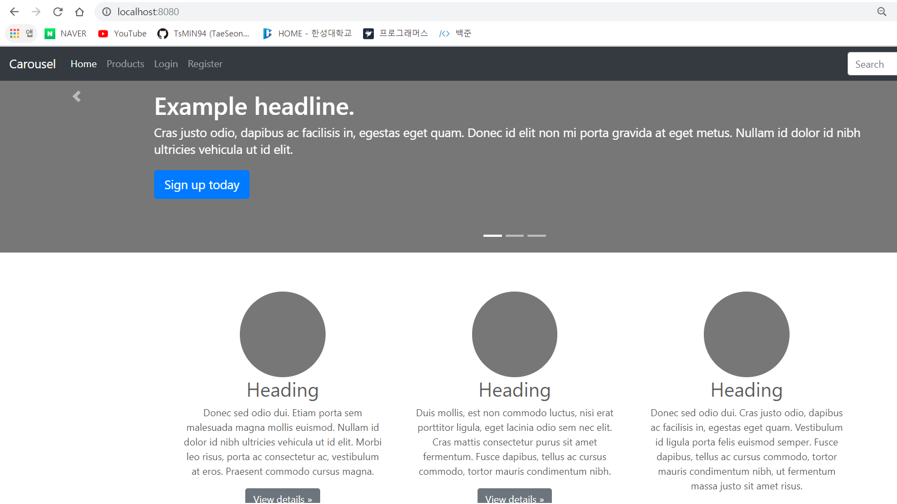
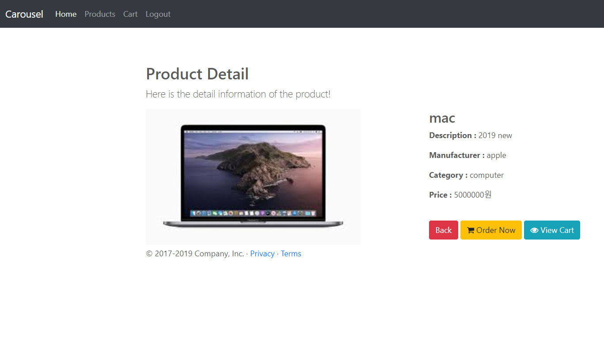
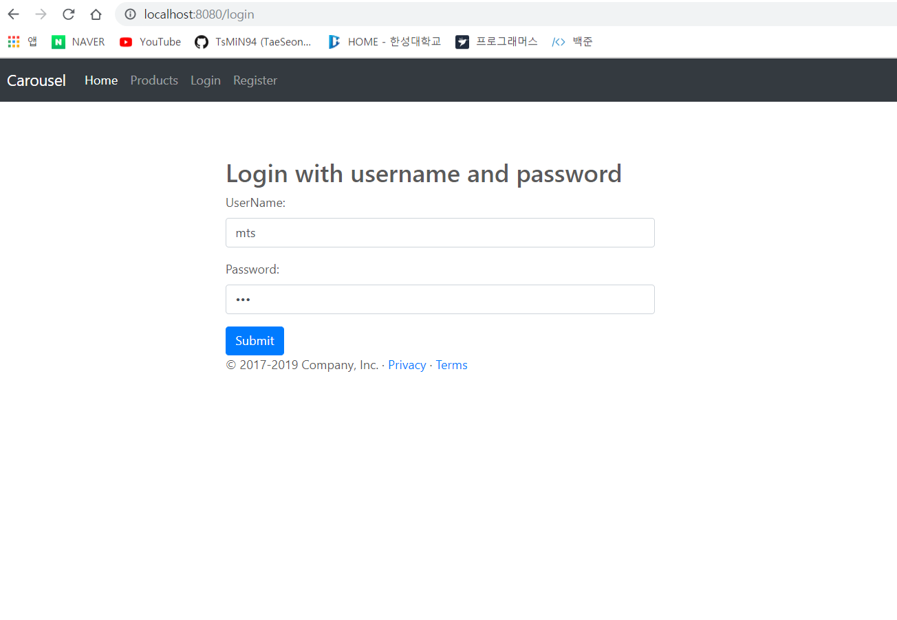
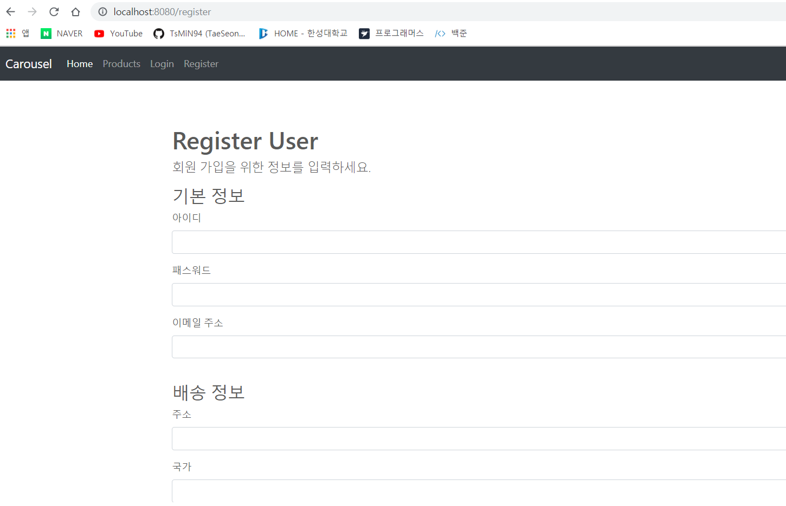
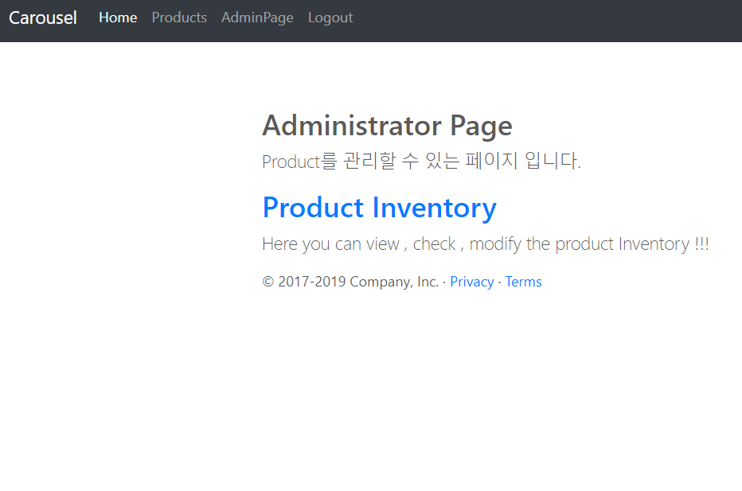
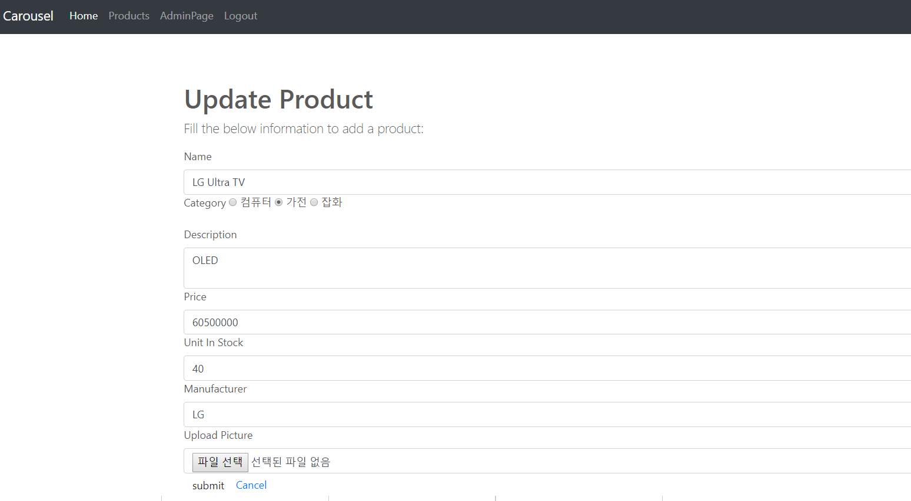

Angular, Spring MVC, Rest API 이용한 간단한 웹페이지 입니다.
===
- 홈페이지에 접속하여 로그인하고 Admin 권한을 가진 유저가 만들어둔 Product를 장바구니에 담고 구매할수 있는 간단한 홈페이지입니다.

- bootstrap을 사용하여 UI 구현
    - 반응형 웹 어플리케이션을 구성할수 있다.
    - 다양한 엘리먼트들을 가져와 구현할수 있다.

- angularjs

- Rest API

Home
=== 

 - 4개의 Category
    - Home : 홈페이지의 메인 화면을 볼수 있다.
    - Products : Admin권한을 가진 유저가 만들어둔 Product list와 각 product의 상세정보및 구매를 할수 있다.
    - Login : 회원가입한 정보로 로그인하여 홈페이지를 이용할수 있다.
    - Register : 회원가입을 위한 정보를 입력한다.

### Products

- Admin 관리자가 사전에 등록해둔 Product의 리스트를 볼수 있다.

- 각 Product에 대한 자세한 정보를 보며 구매할수 있다.

Login
===

- 홈페이지 이용을 위함 사용자 정보 입력

Register
===

- 회원가입을 위한 유저의 인적사항 입력

- 올바른 정보가 들어가지 않을경우 페이지 redirect하여 다시 입력하도록 요청

AdminPage
===

- 관리자로써 상품을 관리할수 있다.

- 상품을 제거하거나 상품안에 있는 내용을 수정 가능하다.
